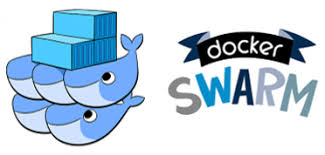

#Automation of supervising simulator in a parallel calcul environment with Docker 

##Goal of this project :
We want to automation the execution of simulator calcul with docker to simulate urban movement using MATSim

##Ressources :
<div style="text-align-center" markdown="1">

[](https://www.npmjs.com/package/protobufjs) 
[](https://www.matsim.org/) 
[](https://docs.docker.com/engine/swarm/)

</div>

##Installation and usage guide :

First step, check that you correctly install docker, if you haven't already docker Follow this link : https://docs.docker.com/install/

Then you will need to launch the Node server, you will find a "docker_start.sh" that will build you a container and ask you how many Node server you want to build.

Note that your container will be build with the name "node_calcul" and will listen on port 8080, the range to send information to the node server start at 49160.

If you want to be sure that your node server is on, you can use a curl and will see this :

```
curl -i localhost:49160

HTTP/1.1 200 OK
X-Powered-By: Express
Content-Type: text/html; charset=utf-8
Content-Length: 5
ETag: W/"5-ThJDvSLGbnbCup7dwfkTlOV/n4M"
Connection: keep-alive
```
