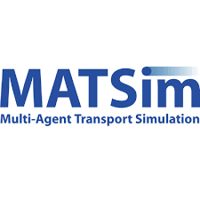

# Automation of supervising simulator in a parallel calcul environment with Docker 

## Goal of this project :
We want to automation the execution of simulator calcul with docker to simulate urban movement using MATSim

## Ressources :

 
 

